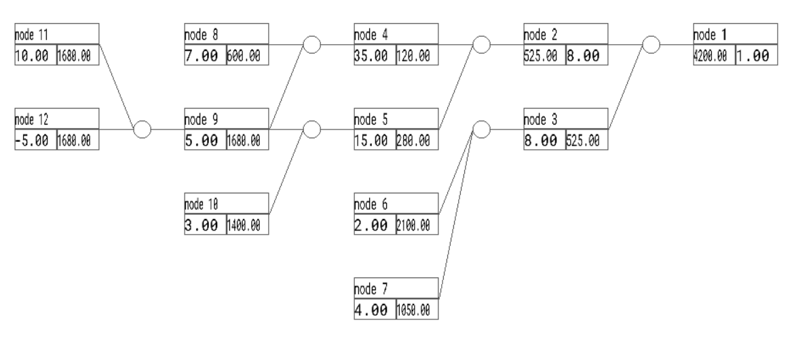

# CMicroGrad
This project is a simple autograd engine for scalar values, inspired by Andrej Karpathy's Micrograd tutorial. 
It allows the construction of computational graphs for scalar operations and uses SDL for visualizing the graph structure. 
The engine supports basic arithmetic operations and automatic differentiation for backpropagation.

## Features
- Scalar arithmetic operations (add, subtract, multiply, divide)
- Automatic gradient computation through backpropagation
- Graph visualization using SDL

## Quick Start

### Prerequisites
- C Compiler (GCC/Clang)
- SDL2 and SDL2_ttf libraries

### Example Usage

```c
#include "autograd.h"

int main(void) {
  Value *_a = value_create(10.0);
  Value *_b = value_create(-5.0);
  Value *a = value_add(_a, _b);

  Value *f = value_create(7.0);
  Value *af = value_mult(f, a);

  Value *b = value_create(3.0);
  Value *ab = value_mult(a, b);

  Value *afb = value_mult(af, ab);

  Value *c = value_create(2.0);
  Value *d = value_create(4.0);
  Value *cd = value_mult(c, d);

  Value *out = value_mult(afb, cd);

  // Call backprop on the output node
  backprop(out);

  // Display a graph visualization of the network
  init(out)

  return 0;
}
```

This is what the output visualization would look like for this graph:
